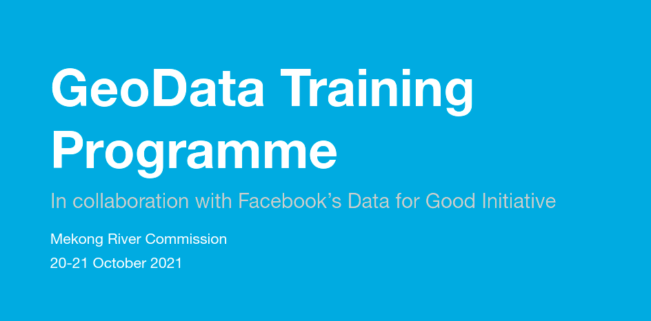

# GeoData Training Programme

```html markup

```

## Overview

This training guide for trainers of the OKF x Facebook GeoData Training Programme is a useful resource that records the lessons learned from previous training sessions and provides best practice approaches to the planning, implementation, and monitoring of the training programme.


## Timeline


```html markup
<table>
  <tr>
   <td><strong>Time</strong>
   </td>
   <td><strong>Activities.</strong>
   </td>
  </tr>
  <tr>
   <td>6 weeks before live training
   </td>
   <td>
<ul>

<li>Initial communication and reaching out to participants

<li>Coordination meeting with Open Knowledge
</li>
</ul>
   </td>
  </tr>
  <tr>
   <td>5 weeks before live training
   </td>
   <td>
<ul>

<li>Completion of pre-event surveys by participants
</li>
</ul>
   </td>
  </tr>
  <tr>
   <td>4 weeks before live training
   </td>
   <td>
<ul>

<li>Preparation of training agenda

<li>Preparation training materials

<li>Participants added to Slack channel

<li>Coordination meeting with Open Knowledge
</li>
</ul>
   </td>
  </tr>
  <tr>
   <td>3 weeks before live training
   </td>
   <td>
<ul>

<li>Preparation of training agenda

<li>Preparation training materials

<li>Participants added to Slack channel

<li>Coordination meeting with Open Knowledge
</li>
</ul>
   </td>
  </tr>
  <tr>
   <td>2 weeks before live training
   </td>
   <td>
<ul>

<li>Final training agenda

<li>Final training materials

<li>Coordination meeting with Open Knowledge
</li>
</ul>
   </td>
  </tr>
  <tr>
   <td>1 week before live training
   </td>
   <td>
<ul>

<li>Technical dry run with trainers

<li>Training website event page

<li>Coordination meeting with Open Knowledge
</li>
</ul>
   </td>
  </tr>
  <tr>
   <td>Week of live training
   </td>
   <td>
<ul>

<li>Live training
</li>
</ul>
   </td>
  </tr>
  <tr>
   <td>1st week of mentoring phase
   </td>
   <td>
<ul>

<li>Mentoring of participants

<li>Updating of project tracker

<li>Coordination meeting for the mentoring phase with Open Knowledge
</li>
</ul>
   </td>
  </tr>
  <tr>
   <td>2nd week of mentoring phase
   </td>
   <td>
<ul>

<li>Mentoring of participants

<li>Updating of project tracker

<li>[optional] Advanced mentoring session
</li>
</ul>
   </td>
  </tr>
  <tr>
   <td>3rd week of mentoring phase
   </td>
   <td>
<ul>

<li>Mentoring of participants

<li>Updating of project tracker

<li>[optional] Advanced mentoring session
</li>
</ul>
   </td>
  </tr>
  <tr>
   <td>4th week of mentoring phase
   </td>
   <td>
<ul>

<li>Mentoring of participants

<li>Updating of project tracker

<li>[optional] Final presentation activity
</li>
</ul>
   </td>
  </tr>
  <tr>
   <td>1-3 weeks after mentoring phase
   </td>
   <td>
<ul>

<li>Follow-up completion of projects and reports

<li>Updating of project tracker

<li>Send and compile post-event survey

<li>Training retrospective with Open Knowledge

<li>Generate and submit final reports
</li>
</ul>
   </td>
  </tr>
</table>
```
